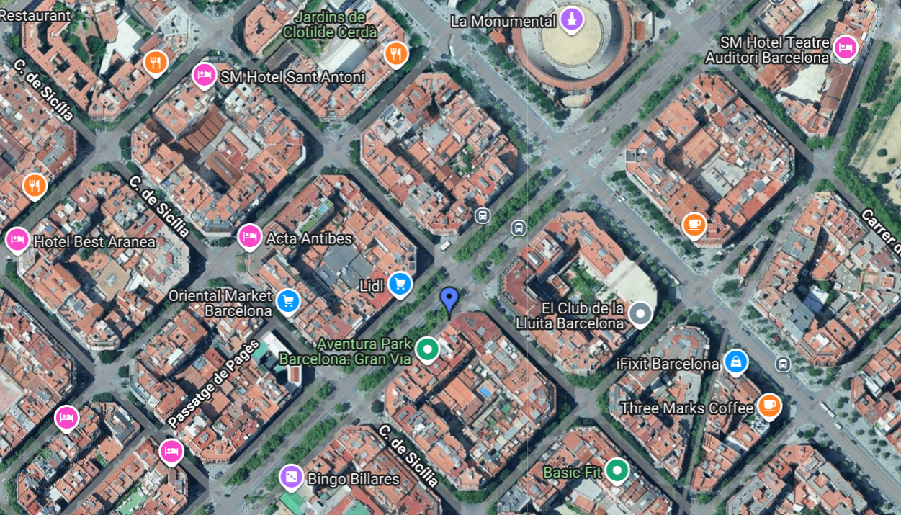

# Problem Specification Summary

This project analyzes historical data from the Barcelona bike sharing
system to identify the most **critical timeslot** (weekday--hour) for
each station.\
A station is considered **critical** when its number of free slots is
**0**, meaning it is completely full.

The analysis uses two datasets: 
- `register.csv`: timestamped readings
of used and free slots for each station
- `stations.csv`: station coordinates and names

The Spark application: - Computes criticality for each (station,
timeslot) - Filters timeslots above a minimum criticality threshold -
Selects the most critical timeslot per station (with deterministic
tie‑breaking) - Outputs results into a single `.kml` file for map
visualization

------------------------------------------------------------------------

# Cluster Configuration Used

The Spark application was executed on the **Polito BigData Cluster**
using:

-   **Server Options:** Bigdata Education Reserved
-   **Allocated Resources:**
    -   4 CPU Threads
    -   16 GB Memory
-   **Maximum Possible Resources:**
    -   16 CPU Threads
    -   32 GB Memory

------------------------------------------------------------------------

# Final Output

After executing the Spark job, the system generated a KML file (see Out_data/output.kml). for visualizing the most critical stations you can upload the kml file to https://kmlviewer.nsspot.net and see the map.\
The final output image is available in the main directory as:

This map highlights stations that frequently reach full capacity, along
with their critical timeslots.
